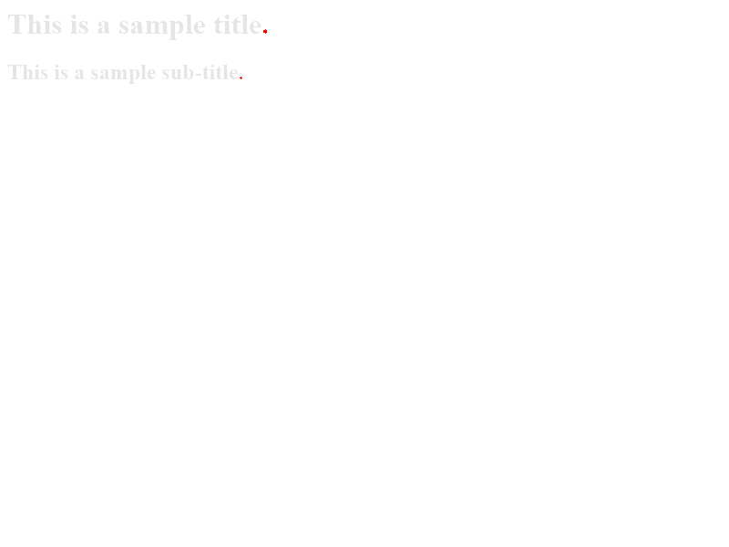
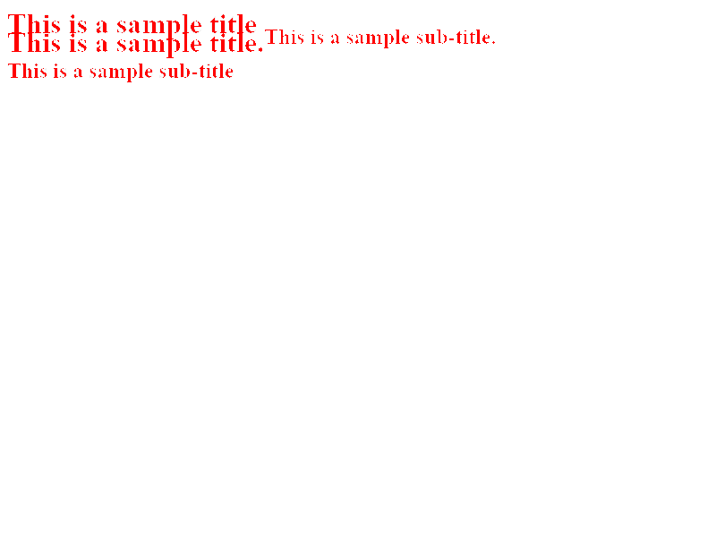

# Automated tests with Puppeteer
Software testing is a serious and required task to reach a certain quality. This blog post focuses on how it can be automated with Puppeteer. Before going into the details of Puppeteer, we should go over software testing and clarify the concepts related to it.

## Software Testing
"Production-ready software requires testing before it goes into production" [1]. One approach is to follow manual testing and the other approach is to automate the whole testing process. "It's obvious that testing all changes manually is time-consuming, repetitive [, not scalable] and tedious. Repetitive is boring, boring leads to mistakes" [1] that we don't want. Therefore, automation is a great alternative for those repetitive tasks. Further, automation of tests can deliver requested development pace and reliability of the software product, especially on a massive scale. In addition to these, ensuring the reliability and stability of the software is also very important for the developers in order not to lose time on bugs created by changing code blocks. Specifically, it becomes very curial when team size increases.

Test pyramid [2] is a key concept to follow when you want to write automated tests in your software. This concept defines how much tests you should add to your software for each level. There are three layers of this pyramid:
- **Unit Tests**
  - Tests that cover isolated pieces of code, e.g. functions, etc.
- **Service Tests** (Currently, this is accepted as **Integration Tests** by the community)
  - Tests that cover connected pieces of the application, e.g. database, filesystem, etc.
- **User Interface Tests** (Again, this is accepted as **End-to-End Tests** by the community, right now.)
  - Tests that cover the whole journey of functionality from user interaction to services, e.g. login flow, purchase flow, etc.


Generally, this pyramid suggests that:
- "Write tests with different granularity" [1]
- "The more high-level you get the fewer tests you should have" [1]

However, this approach may not suit for each case. In your software, for instance, you may have less business logic and more integration. In this case, you may want to add more integration tests to your software. Therefore, it is best to think of how many tests you should write for each granularity. (You can check this post for more discussion: [https://kentcdodds.com/blog/write-tests](https://kentcdodds.com/blog/write-tests))

<blockquote class="twitter-tweet"><p lang="en" dir="ltr">expect(umbrellaOpens).toBe(true)<br><br>tests: 1 passed, 1 total<br><br>**all tests passed** <a href="https://t.co/p6IKO7KDuy">pic.twitter.com/p6IKO7KDuy</a></p>&mdash; Erin 🐠 (@erinfranmc) <a href="https://twitter.com/erinfranmc/status/1148986961207730176?ref_src=twsrc%5Etfw">July 10, 2019</a></blockquote> <script async src="https://platform.twitter.com/widgets.js" charset="utf-8"></script>

As this blog post is related to automated tests with Puppeteer, we need to discuss more end-to-end tests since Puppeteer is more appropriate for them.

### When do you really need end-to-end testing?
End-to-end tests are useful to identify problems in user journeys. User journeys are the flows that a user can follow in your application. Therefore, the idea of end-to-end tests is to imitate a user's behavior in certain flows from start to end to ensure that everything works as expected. Running end-to-end tests are slower than to unit tests since they can touch many components of your application or third party services. As a result, we can think of them as expensive in terms of resources that reserved for them. For instance, assume that you want to run end-to-end tests of a web application, to accomplish this you need to run a browser and this browser consumes a significant amount of memory. Furthermore, the initialization of the browser and the other components takes a lot of time. Hence, only relying on end-to-end tests is not preferable in terms of development efficiency. Therefore, you may want to write end-to-end tests for high-value interactions of your application.

## What is Puppeteer?
[Puppeteer](https://pptr.dev/) provides a high-level API to control Chrome or Chromium programmatically. It is an open-source Nodejs library. Puppeteer runs headless (i.e. a browser that doesn't have a user interface) by default, but can be configured to run full (non-headless) Chrome or Chromium.

With this tool, you can run your web application on a browser and imitate user actions programmatically.

### Use cases:
- Generate screenshots and PDFs of pages.
- Crawl an SPA (Single-Page Application) and generate pre-rendered content (i.e. "SSR" (Server-Side Rendering)).
- Automate form submission, UI testing, keyboard input, etc.
- Create an up-to-date, automated testing environment. Run your tests directly in the latest version of Chrome using the latest JavaScript and browser features. Run regression and end-to-end tests.
- Capture a timeline trace of your site to help diagnose performance issues.
- Test Chrome Extensions.
- Check for console logs and exceptions.
- Replicate user activity.

### Jest and Puppeteer
Puppeteer API is not designed for testing and it doesn't provide you the whole functionality of a testing framework. Therefore, it can be used with [Jest](https://jestjs.io/) JavaScript testing framework. The samples on this blog post use [jest-puppeteer](https://www.npmjs.com/package/jest-puppeteer) Nodejs library. It provides all required configuration for writing integration tests using Puppeteer with Jest.

### Samples
This section provides a couple of examples to give you better insights into Puppeteer's usage. They don't cover all the futures of the Puppeteer and this blog post doesn't aim to give you the detailed information of Puppeteer API. You can build upon the given examples and explained concepts.

The shown examples are also available at this [GitHub repository](https://github.com/ilhan-mstf/puppeteer-investigation). 

#### Prerequistes and Installation
You need:
- The recent stable version of node.js
- The recent stable version of yarn or npm

Examples have these dependencies:

```json
"devDependencies": {
  "jest": "^25.1.0",
  "jest-puppeteer": "^4.4.0",
  "pixelmatch": "^5.1.0",
  "puppeteer": "^2.1.1"
}
```

`puppeteer` library downloads lastest Chrome executable. You can use `puppeteer-core` instead of `puppeteer` if you want to use existing Chrome executable in your system and pass the path of executable as a configuration option.

You can run the tests with `yarn test` command.

#### Taking Screenshot
You can take screenshot of your website with different options such as setting viewport or emulated device.

```js
const puppeteer = require('puppeteer');

(async () => {
  const browser = await puppeteer.launch();
  const page = await browser.newPage();
  await page.goto('https://designisdead.com/');
  await page.screenshot({path: 'homepage.png'});

  await browser.close();
})();
```

#### Comparing Screenshots
You can detect changes visually by taking screenshots of different versions of your application. You can take screenshots with Puppeteer but you need another tool to compare them. This sample uses [`pixelmatch` library](https://www.npmjs.com/package/pixelmatch).

```js
const fs = require('fs');
const PNG = require('pngjs').PNG;
const pixelmatch = require('pixelmatch');

const img1 = PNG.sync.read(fs.readFileSync('version1.png'));
const img2 = PNG.sync.read(fs.readFileSync('version2.png'));
const {width, height} = img1;
const diff = new PNG({width, height});

pixelmatch(img1.data, img2.data, diff.data, width, height, {threshold: 0.9});

fs.writeFileSync('diff.png', PNG.sync.write(diff));
```

<!--







<div style="clear: both"></div>
-->

|  |  |  |
|:--:|:--:|:--:|
| Version 1 | Version 2 | Diff 1-2 |

|  |  |  |
|:--:|:--:|:--:|
| Version 1 | Version 3 | Diff 1-3 |

Be aware that some of image comparision tools find differences by checking the pixel difference, therefore, if the text is changed, they will show it as a change.

<!--


-->

#### Checking integration of third party applications
You may use third party services, scripts, etc. in your application. Therefore, it will be a good idea to check that their integration with your application works as expected.

```js
describe('Analytics', () => {
  beforeAll(async () => {
    await page.goto('https://designisdead.com/')
  })

  it('should return google tag manager', async () => {
    const tagManager = await page.evaluate(() => google_tag_manager)
    expect(tagManager).toBeDefined()
  })
})
```

#### Mobile and Desktop Layout
Since there is a significant variance in screen sizes, there are a lot of cases that need to be tested here.

```js
const devices = require('puppeteer/DeviceDescriptors');
const iPhonex = devices['iPhone X'];

describe('Mobile', () => {
  beforeAll(async () => {
    await page.emulate(iPhonex)
    await page.goto('https://designisdead.com/')
  })

  it('should render hamburger menu', async () => {
    await page.waitForSelector('.Page-hamburger', {
      visible: true
    })
  })
})
```

```js
describe('Desktop', () => {
  beforeAll(async () => {
    await page.setViewport({ width: 1280, height: 768 })
    await page.goto('https://designisdead.com/')
  })

  it('should not render hamburger menu', async () => {
    await page.waitForSelector('.Page-hamburger', {
      hidden: true
    })
  })
})
```

#### Seo checks
Since search engines crawl your production website, it may be a good idea to check your pages' SEO performance. However, even if the below example handles this issue on test cases, you may want to generate a score and corresponding report.

```js
describe('SEO', () => {
  beforeAll(async () => {
    await page.goto('https://designisdead.com/')
  })

  it('should display "Design is Dead" text on title', async () => {
    await expect(page.title()).resolves.toMatch('Design is Dead')
  })

  it('should have description meta-tag', async () => {
    const descriptionContent = await page.$eval("head > meta[name='description']", element => element.content);
    
    expect(descriptionContent).toBeDefined();
  })

  it('should have a headline', async () => {
    const headlines = await page.$$('h1')

    expect(headlines.length).toBe(1)
  })
})
```

## Selenium and other tools to automate browsers
Puppeteer is not the only tool that provides higher level API to manage and automate browsers. [Playwright](https://www.npmjs.com/package/playwright) is an alternative Node library that supports Chromium, Firefox and WebKit. It is developed by the same team built Puppeteer and its API is very similar to Puppeteer. Another options is [Selenium](https://www.selenium.dev/). It supports all the major browsers. Futher, you can use Selenium with Java, Python, Ruby, C#, JavaScript, Perl and PHP.

## Conclusion
In this blog, we go over the levels of software testing and discuss the use of cases of end-to-end tests. Later, we look into the details of Puppeteer as an end-to-end test tool by giving some examples. 

## References:
- [1] https://martinfowler.com/articles/practical-test-pyramid.html
- [2] Mike Cohn, Succeeding with Agile

## Suggested Readings:
- https://martinfowler.com/bliki/TestPyramid.html
- https://www.freecodecamp.org/news/why-end-to-end-testing-is-important-for-your-team-cb7eb0ec1504/
- https://blogs.dropbox.com/tech/2019/05/athena-our-automated-build-health-management-system/
- https://medium.com/coursera-engineering/improving-end-to-end-testing-at-coursera-using-puppeteer-and-jest-5f1bac9cd176
- Running Puppeteer on serverless: https://github.com/alixaxel/chrome-aws-lambda
- https://medium.com/@ymcatar/visualization-on-steroid-using-headless-browser-to-auto-refresh-google-data-studio-dashboards-c195e68f10b
- https://www.lambdatest.com/blog/why-selenium-automation-testing-in-production-is-pivotal-for-your-next-release/

## Acknowledgements
Thanks to xxx for sharing their valuable ideas and checking draft version of this blog post.

-- Mustafa İlhan, 2020, İzmir
